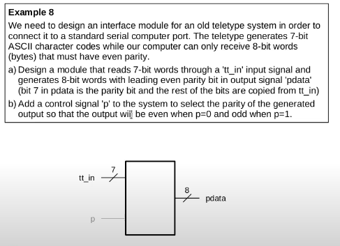

# Parity generator

This task involves designing an interface module that converts a 7-bit ASCII input from a teletype into an 8-bit output for a computer. The 7-bit input, provided on the signal `tt_in`, is directly copied into the lower 7 bits of the output (`pdata`), while the most significant bit (MSB) is used as a parity bit. A control signal `p` selects the parity type:  
- **p = 0:** Even parity (the total number of 1s in the 8-bit word should be even)  
- **p = 1:** Odd parity (the total number of 1s should be odd)

For example, consider the 7-bit data `0101010` which has 3 ones:  
- **Even Parity:** Since 3 is odd, the parity bit is set to 1 to make the total 4 (even), resulting in `1 0101010`.  
- **Odd Parity:** Since the total is already odd, the parity bit is set to 0, resulting in `0 0101010`.

This extra parity bit serves as a simple error-checking mechanism by ensuring the expected even or odd count of 1s.