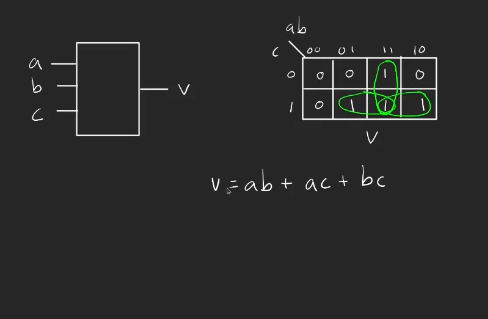

Reference for Verilog HDL: [Verilog 2001 Reference Guide](https://sutherland-hdl.com/pdfs/verilog_2001_ref_guide.pdf)

# Building a voter circuit

A voter circuit is a digital logic circuit that produces an output based on the majority value of multiple inputs. For a 3-input voter:

- Output is 1 if two or more inputs are 1
- Output is 0 if two or more inputs are 0

## design



## implementing in verilog

```verilog
// simple verilog voter

`timescale  1ns /1ps

 module voter (
    input wire a,
    input wire b,
    input wire c,
    output wire y
    );

    assign y = a & b | a & c | b & c;

 endmodule
```

# writing a testbench

A testbench is a specialized piece of code used to verify the functionality of your hardware design. It creates a controlled environment where you can:

- Apply test inputs
- Monitor outputs
- Check if the design behaves as expected

Here's a testbench for our voter circuit:

```verilog
// testnemch for the voter

`timescale  1ns /1ps

module test;

    reg a, b, c;  //UUT inputs
    wire v;       // UUT output

        // Instantiate the voter module
    voter uut (
        .a(a),
        .b(b),
        .c(c),
        .y(v)
    );


    always #8 a = ~a;
    always #4 b = ~b;
    always #2 c = ~c;

    initial begin
        a = 0;
        b = 0;
        c = 0;

        $dumpfile("voter_tb.vcd"); all varilb
        $dumpvars(0, test);

        #16 $finish;
    end

endmodule
```

### compiling  
`iverilog voter.v voter_tb.v`
### executing
`vvp a.out`

### viewing on GTKwave 
`gtkwave voter_tb.vcd`